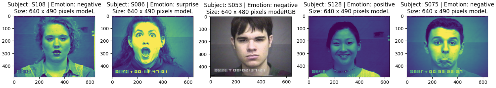

# Facial Emotion Detection

## Description
Building a classification model using neural network techniques (Pre trained ResNet 50) to be able to recognize the facial emotion of a human face from an image as a input.

## Data
The data used from the Cohn-Kanade Dataset. In this dataset there is images present of 123 subjects.Each subject had one or more images which were labelled with their respective FACS code and emotion label of their output image. After performing exploratory data analysis of this data it was found that the images presentare around the size of 640x490 pixels also data was significantly imbalanced to particular classes in the labels of FACS codes and high level emotion.

## Data Preprocessing

### Data Splitting
The dataset was split into three sets (training, validation, test sets). To avoid data leakage the data was split based on the subject such that there are no common subjects present in any of the sets.

### Data Preprocessing
A custom data loader was created to load the dataset into the various generators. The data loader imports the image from the path mentioned on the dataset. The loader also performs label encoding on the data set to make the data optimal for the neural network models. The data loader pre-processes the images before loading them into the data generators and as the selected model was the ResNet 50 model the image sizes and mode was resized to 224x224 and image mode was converted to RGB

### Data Augmentation
For the training data additional flag of augmentation and shuffle was added (shuffling the data after each epoch). This training data when added the data is augmented to add additional data and also generalization to
the model so that it will be able to deal with any kind of data and not overfit towards training data. The data augmentation used involve
• Resize with crop or pad which increases the size of the image with padded pixels
• Random crop on the padded image to the desired size of 224x224
• Random flip of image data left or right
• Random changes to brightness of the image
These changes should help introduce generalized data to the model.

## Evaluation Framework
The models was evaluated based on the history curves of a model (loss and accuracy curves) for the training and the validation data to identify whether the current model has overfitted or underfitted towards the training data and the necessary measures were taken to tackle these issues. The loss function used for AU labels was binary cross entropy and emotion was categorical cross entropy and the accuracy metric used for the AU labels was binary accuracy and emotion was categorical accuracy as the values of the FACS codes (AU labels) can only be either 1 or 0 and the labels for emotion are categorized into three categories. Due to the data being imbalanced class weights of each feature was measured and implemented into the model. Other measures such as precision, recall, AUC (area under the ROC curve) and F1 score[4] was also measured as imbalance present in the data may affect the loss and accuracy metrics. The final model was selected based on the combination of best metrics. Early stopping was added to each model based on the validation loss. Every model was checkpointed to save the parameters used by a particular model.

## Model Selection 
The baseline model selected for this implementation was the ResNet50 as in the research paper for ‘Classification of Real and Fake Human Faces Using Deep Learning’ ResNet50 model was the best performing among other model such as the VGG16, MobileNet, InceptionV3 models to perform for facial image classification. As this aligns with the problem in hand pretrained ResNet50 model on image net was selected.

## Parameter Tuning
The baseline model was tuned by various methods
- adding class weights
- introducing a learning rate scheduler
- changing optimizer
- changing batch size
- changing units of dense layer
- Fine tuning the model

## Final Analysis
The Final selected model was model with a dense layer of 256 as it had good fit on the curves with no signs of overfitting and showed a good performance overall compare to the other models.
The test set was then run on this model it was able to provide with this output.
FACS: Loss: 0.5191, Binary Accuracy: 0.7781, Precision: 0.5156, Recall: 0.1535, AUC: 0.6634, F1 score:
0.2366
High_level_emotion: Loss: 1.0287, Categorical Accuracy: 0.5156, Precision: 0.5156, Recall: 0.5156, AUC:
0.6424, F1 score: 0.5156
Overall the performance was okay not that great this maybe mainly because it had to be tuned with balancing the outputs for the two features.

